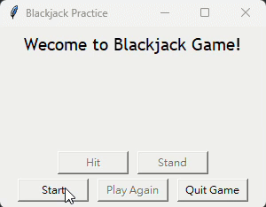

# Blackjack_Game
A simple Blackjack game built using Python and Tkinter.
> This project was built as part of an introductory Python programming course.  
> It demonstrates how to use only core Python features and the standard `tkinter` GUI library to develop a fully functional Blackjack game without relying on any external libraries.
> 
---

## 🎮 How to Play

- Click **Start** to deal your hand
- Choose **Hit** to draw a card, or **Stand** to end your turn
- Dealer draws until at least 17
- Win, lose, or push based on Blackjack rules

---

## 🛠 Built With

- Python 3.12
- Tkinter (standard GUI library)

---

 ## 📷 Demo

